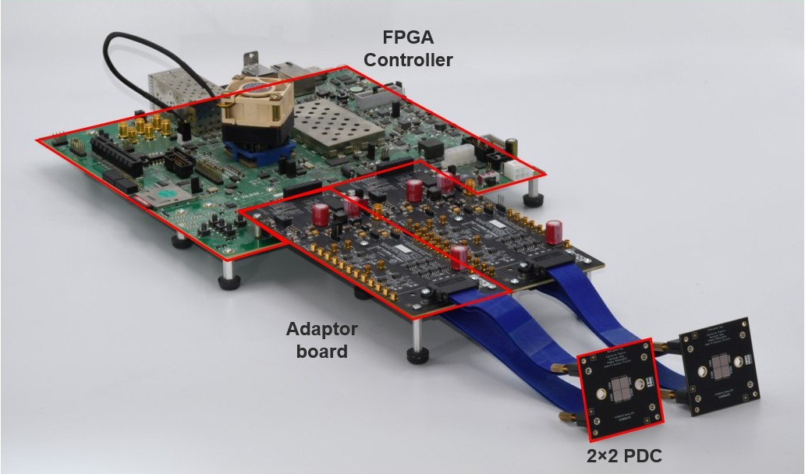

# PDCv2 Development Kit

This repo hosts all the scripts required to get you started using the development kit for our PDCs.
The development kit consists of a ZCU102 FPGA board, two adaptor boards and two 2x2 heads for detection.



The complete setup will make use of an host computer communicating with the ZCU102 via Ethernet to for control, configuration and data acquisition.
We recommand reading through the [ZCU102 Getting Started Guide](./documentation/gettingStarted/zcu102.md) for a better undestanding of how the setup works before plugging everything and start using it.
A better understanding of the platform might help troubleshoot issues you may have on your setup.

## Getting started

To get started using the platform, you will need a Linux computer with an Ehternet port or USB dongle, an SD card and a SD card reader.
For Linux, recent debian-based LTS distributions and red-hat based distribution are supported (i.e. Ubuntu-20.04, Ubuntu-22.04, Ubuntu-24.04, Almalinux 8).
Here are the list of the steps required to get the setup up and running.

1. Clone this repo on the PC you want to use as host (if you are new to git, you can follow [this guide](https://docs.github.com/en/repositories/creating-and-managing-repositories/cloning-a-repository)).
2. Fetch the `img.tar.gz` file from the release tab of this repo then extract. This archive contains the `*debian_image.img` to flash your SD with.
3. Flash the SD card with the image `*debian_image.img` provided in the repo. This can be done with [balenaEtcher](https://etcher.balena.io/) or other equivalent programs/tools.
4. Insert the SD card in your ZCU102 board and connect it via Ethernet to the host. Power-it on. 
5. Run the script `setupHosts/setup.sh` to install required packages and configure the host computer. Feel free to look at it to understand what has been installed and configured on you PC. After this has run, you should be able to communicate with the ZCU102 board and FPGA and connect to it by running `ssh zcudev`.
6. Activate the created python environment: `source ~/venv_pdcv2/bin/activate`.
7. To test communication with your PDCs, connect the heads using the blue cables to the adaptor board, power-on the adaptor boards, and run the test script `hostApps/python/validatePDCCommunication.py`. 
You can do so by placing the power switch towards the ZCU102 ([view image](documentation/images/adaptor_board.jpg)). 
These tests will only validate the communication with the digital core of the chips without enabling any SPADs.
7. Everything, should work. If not, you can read through the [ZCU102 Getting Started Guide](./documentation/gettingStarted/zcu102.md) to help you troubleshoot where the issue might be.
Don't hesitate to contact us to help you debug your setup.

## Host Computer scripts

This repo contains an suite of scripts to help you setup basics functionalities of the PDC. 
There are some helpers to start and monitor the application mentioned in the [ZCU102 Getting Started Guide](./documentation/gettingStarted/zcu102.md) (dataReader, dma2h5).
The only prior steps to running these steps is having the setup script on the host beforehand and mounting the NFS folders on the ZCU102 through the `setup-zynq` script (see [ZCU102 Getting Started Guide](./documentation/gettingStarted/zcu102.md) section 1.10).

```
└───hostApps/python
│   └───modules # Utility classes for different functionalities
│       │   fgColors.py: Add colors in prints in the terminal
│       │   h5Reader.py: Manage generated HDF5 file and access data elements
│       │   pdcHelper.py: Configure the different registers of the PDC
│       │   pixMap.py: Map the ID of the pixel to its X/Y coordinates
│       │   sshClientHelper.py: Open a ssh connection to the ZCU102 and forwards commands to the applications
│       │   systemHelper.py: Miscellaneous (print formatting...)
│       │   zynqCtlPdcRoutines.py: Configure and control the Tile Controller state machine and send various commands
│       │   zynqDataTransfer.py: Manage the dataflow between the ZCU102 and the host computer (dataReader, dma2h5, NFS server validation, etc...)
│       │   zynqEnvHelper.py: Module to set path and variable to use for the scripts
│       │   zynqHelper.py: Manage auxiliary features of the ZCU102 board (hardware info, delay line configuration) 
    # Various graphical application configuring the PDCs with active SPADs to display different informations
│   │   getSpadTcrUcrCcrUsingFlag.py: Get the different count rates (total, uncorellated and correlated) of the SPADs
│   │   getSpadTcrUsingFlag.py: Get the total count rates of the SPADs
│   │   openCtlDataComm.py: Starts the communication channels of the platform (NFS server validation, dma reader and dma2h5)
│   │   plotDsum.py: Displays the digital sum
│   │   preparePdc.py: Utility for inital PDC configuration
│   │   testPixQcUsingTrigger.py: Tests the quenching circuits of the chip using the internal trigger
        # Misc:
│   │   validatePDCCommunication.py: Test to validate that you can communicate with your
│   │   requirements.txt: List of python modules to install. Should already be installed in the `venv_pdcv2` created with the setup script
```

These should help you visualize incoming information from your PDC and develop new appliations tailored to your setup.
New scripts might come in the future to help you develop more complex setups, either developped by the team at Sherbrooke or other user of the platform.


