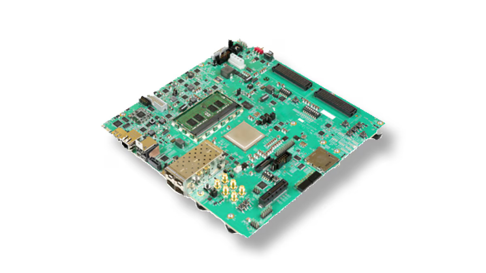
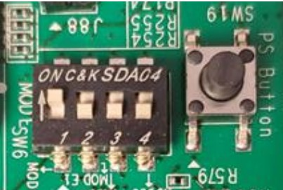
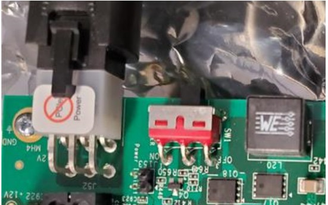
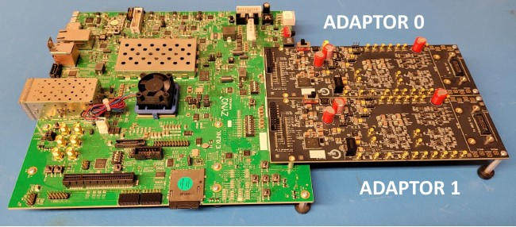
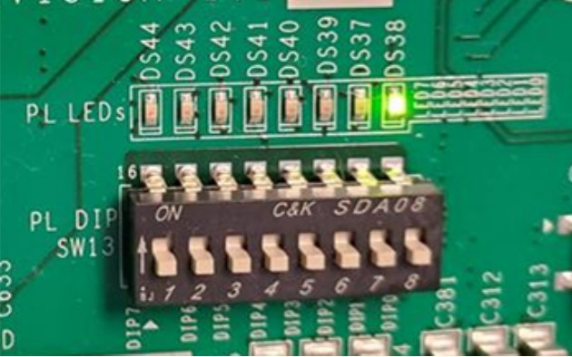

### Getting Started with ZCU102 for PDC V2

## Table of Content

- Getting Started with ZCU102 for PDC V2
- 1 Out of the box and general information
    * 1.1 ZCU102 Evaluation Board – Overview
    * 1.2 ZCU102 Evaluation Board – User Guide.
    * 1.3 ZCU102 Boot Switches (SW6)
    * 1.4 ZCU102 Debian Image.
    * 1.5 Preparing/Updating the ZCU102 Image
    * 1.6 ZCU102 Power supply.
    * 1.7 ZCU102 Serial Link
    * 1.8 Getting the IP address of the ZCU102
    * 1.9 First steps with the ZCU102 command line interface
    * 1.10 Establishing the Network File System (NFS) link between the ZCU102 and the Host PC
    * 1.11 Enabling the Direct Memory Access between the FPGA and the Embedded ARM Processor
- 2 System Setup
- 3 High Voltage to Bias the SPADs
- 4 Power-up sequence
- 5 Power-down sequence


## 1 Out of the box and general information

The general information in this section should be read before the first boot up sequence of the system.

#### 1.1 ZCU102 Evaluation Board – Overview

The ZCU102 evaluation board implements a System on Chip (SoC) which is a Zynq UltraScale+ from
Xilinx. This SoC includes an FPGA referred to as Programmable Logic (PL) and an ARM processor
referred to as the Processing System (PS). The evaluation board all the hardware required by the
Zynq UltraScale+ to work and multiple standard peripherals are also implemented on the ZCU
like Ethernet Port, SD card support, serial link and many others. The ZCU102 also includes two
FPGA Mezzanine Card (FMC) expansion connectors to add custom hardware.



#### 1.2 ZCU102 Evaluation Board – User Guide.

Before any manipulation with the ZCU102 board, the user must read the ZynqUltrascale+ MPSoC
ZCU102 Evaluation Kit Quick Start Guide provided in the ZCU102 box [Document XTP426](
https://www.xilinx.com/support/documentation/boards_and_kits/zcu102/xtp426-zcu102-quickstart.pdf).

For any further questions regarding the ZCU102, the user should refer to the ZCU102 Evaluation
Board User Guide [Document UG1182](
https://docs.amd.com/v/u/en-US/ug1182-zcu102-eval-bd)

#### 1.3 ZCU102 Boot Switches (SW6)

The Zynq on the ZCU102 can boot from different modes (JTAG, QSPI, SD). These modes are set using
SW6 on the ZCU102 (Figure 2). The Built-In Self-Test can be done using QSPI32 boot mode. Then,
the required mode is SD by setting SW6 [4:1] = off, off, off, on. (UG1182, p. 21, Table 2-4)


| Boot Mode | Mode Pins [3:0]   | Mode SW6 [4:1]        |
| --------  | ----------------- | --------------------- |
| JTAG      | 0000              | on, on, on, on        |
| QSPI32    | 0010              | on, off, on, on       |
| SD        | 1110              | on, off, off, off     |


Notes: For this DIP swith, in relation to the arrow, moving the switch the ON is a 0. DIP swith labels 1:4 are equivalatent to Mode pins 0 through 3.



#### 1.4 ZCU102 Debian Image.

The ZCU102 will boot a Debian image giving you access to a standard Linux shell experience.
It is configured to work with the user `zynq` and passwrd `zynqUS`, which has root access.
We recommand you use this user to connect via ssh to the board.

Upon login, in the home directory of the `zynq` user, there is a script called ZYNQ_README.
Executing it will print the output of each appiclation supplied with the image and its option.
Most of these application are used to configure specific registers of the FPGA controller and its connected PDCs.

#### 1.5 Preparing/Updating the ZCU102 Image

To prepare the SD card or to update the image, you can simply reflash the SD card with the new .img file.
This can be done with [balenaEtcher](https://etcher.balena.io/) or other equivalent programs/tools at your disposal.
Note that any data on the card will be lost so make a copy of any data you might want out of the SD card first.

#### 1.6 ZCU102 Power supply.

We recommand to upgrade the power supply provided with the ZCU102 (12 V, 5 A) with an isolated power supply with higher power (12 V 11.25 A). 
The part number of the power supply we recommand is is ME150A1251F from SLPowerElectronicsCorp. 
Always turn off the ZCU102 power switch before connecting the power supply.



#### 1.7 ZCU102 Serial Link

A serial link could be needed between the ZCU102 and the host computer to help troubleshoot connection issues over Ethernet.
The micro USB cable provided in the box can be connected in the USB UART connector of the ZCU102 (J83) to the host PC (Figure 5). 
The baud rate to set is 115200 bit/s.

Note : Install picocom and use command : `picocom -b 115200 /dev/ttyUSB[0-9]`, where [0-9] represents the number of the ttyUSB device to use.

When the connection is opened, a user is prompt. For the typical operation of the setup, the user zynq must be used. 


#### 1.8 Getting the IP address of the ZCU102

If the ZCU102 is connected on a network with a DHCP, the IP address of the ZCU102 must be known.
Using the command `ifconfig` once connected over the serial link will return the IP address.
If it not using DHCP, the default IP adress of the ZCU102 is `102.180.0.16`, which you can use to connect via ssh with the user `zynq` and password `zynqUS`.

#### 1.9 First steps with the ZCU102 command line interface

Once connected over SSH, the user should be in the zynq user home directory (/home/zynq). It contains a readme (zynq-readme) which lists the custom applications built to configure the platform to operate with the PDCs.

For each application, the three following options are useful to retrieve information about the application :

```
-help
Show the options available to use the application. Each option is described.
```
```
-ipid
Most of the applications interact with the FPGA to set configuration registers. 
Each FPGA IP module has its own identification code (ID) and a version. 
The -ipid option help to follow up changes between the different version of the ZCU102 image provided by Sherbrooke.
A change in the version number implies a change in the FPGA IP.
```
```
-version
For each application that runs on the processor, the -version option helps track the changes in the application. 
It includes the date on which the application has been modified and the build date.

```
#### 1.10 Establishing the Network File System (NFS) link between the ZCU102 and the Host PC

The ZCU102 platform uses a NFS folder on the server which contains three sub-folders:

1. data
    This is where the results from the ZCU102 platform are saved. For example, the results from the PDC sum are saved in a file called pdcsumX.hex.
    With the application hit-cnt, if the `-save` option is used, the results of the counter will be saved in a file calledhit_cnt_chX.txt.

3. bin
    This can be used to store custom scripts. This directory is included in the PATH variable of the ZCU102. 
    The basic applications and scripts are built in the Debian image, but for custom requirements thebinfolder can be used.

Once the server is configured properly to share the folders with the ZCU102, it can be mounted from the ZCU102 manually with a script after boot up is complete.

```shell
sudo setup−zynq SERVER_IP_ADDRESS:NFS_PATH
```   

The text SERVER_IP_ADDRESS must be replaced with the Host PC IP address (e.g. 102.180.0.1).
NFS_PATH must be replaced with the path of the NFS server containing the two folders, data and bin (i.e. /mnt/zynq/PDCv2).
By default, the nfs_server IP is configured is in the `/etc/hosts` of the ZCU102, which you should be able to use instead of the static IP of the server.
If you change the network configuration of the board, you can update the file to track the new IP adress of the NFS server.


#### 1.11 Enabling the Direct Memory Access between the FPGA and the Embedded ARM Processor

To transfer the PDC data from the FPGA to the ARM processor, a direct memory access (DMA) is used. 
The application `dataReader` must be launched for the data transfer to work.
The application execution is blocking, which prevents other applications to run in the same terminal.
It can then be launched in a second terminal or with the & background operator.
Once launched, it creates an empty `datafileX.hex`. 
When new data are ready, they are written into the file, the file is closed and a new file is created with its index privileges.

On the ZCU102:
```shell
dataReader  -d /mnt/bin -vvv # Transfers data in binary format to the -d directory with verbose debug output (optional)
```

WARNING : Each time the dma-consumerapplication is started, it restarts from index 0 (e.g.datafile0.hex) and overwrites any previous file with the same name.
Make sure you have collected the data of those files if it was important.

WARNING : the quantity of generated files can increase quickly when a lot of data is acquired from the PDCs.
A good approach is to read each new file that appears in the `data/` folder, parse its content, save it to a database and delete the datafileX.hexfile.
The application called `dma2h5` does that for you, parsing the `datafileX.hex` from the host computer.
It can be used to convert a single file or to automatically read and convert produced hex files and save the contents as HDF5 with the content.
Refer to its `--help` to configure the input and output path of the data, for example:

On the host:
```shell
dma2h5 -i /mnt/zynq/PDCv2 -o ~/HDF5 # Automatically files in th -i directory and writes the hdf5 file to the -o directory
```

## 2 System Setup

WARNING : When working with the Head Boards, it is strongly recommended to use ESD protection equipment such as bracelets to prevent any damage to the PDCs.

1. Connect one or two adaptor boards on the ZCU102. The FMC connector near the power supply input of the ZCU102 (J5 – HPC0) is the adaptor index 0 in the firmware. 
It contains PDC index from 0 to 3.
The other FMC connector (J4 – HPC1) is the adaptor index 1. It contains PDC index from 4 to 7 (Figure 6).
2. Make sure the power switch of the adaptor (S2) is in the external supply position [view figure](./../images/adaptor_board.jpg).



3. Connect the Head to the Adaptor board. Never connect/disconnect a Head board with power on the Adaptor board. Make sure to turn off the Adaptor power switch (S2) or use the software power disable. The cable end with mounted-in screws goes to the Head board. The other end of the cable should always be properly secured on the Adaptor board with the 4-40 screws.
5. Connect both the USB serial and Ethernet cables to the host PC.
6. Make sure the ZCU102 power switch is turned off.
7. Connect the isolated power supply to the ZCU102 (ME150A1251F01 from SL Power Electronics
    Corp). Verify the power rating of the supply is 12 V 11.25 A.


## 3 High Voltage to Bias the SPADs

The voltage to apply on the SPADs (HV) must be negative. 
The range is from 0 to -50 V. 
The SPADs should start triggering at -47 V.
The HV must be applied gradually with a slow ramp up.
When applying the high voltage, it is a good practice to connect the analog monitor or the flag outputs
of the adaptor to an oscilloscope to find the voltage at which the SPADs start to trigger. 
Always make sure that there are enabled pixels connected to a SPAD in the PDCs before applying the high voltage.

## 4 Power-up sequence

Once everything is connected according to section 2, use the following power-up sequence.

1. Power ON the ZCU102.
2. Wait for the board boot-up to be done.
3. Connect to the ZCU102 interface (SSH or serial).
4. Power ON the Adaptor board with the S2 switch to the 12 V FMC position (Figure 7).
5. Run thepowergoodcommand to activate the software power enable.
6. Once everything is booted up, the power good LED should turn ON on the ZCU102 (Figure 9).



7. Program the configuration registers of the PDC for the required application.
8. Ramp up the high voltage to bias the 64 CMOS SPADs contained in the readout according to section 3.


## 5 Power-down sequence

Always use the following power down sequence unless otherwise specified.

1. Ramp down the high voltage that bias the CMOS SPADs.
2. Run thepowerdowncommand to deactivate the sostware power enable.
3. Power OFF the Adaptor board with S2 switch to external position.
4. Power OFF the ZCU102.


